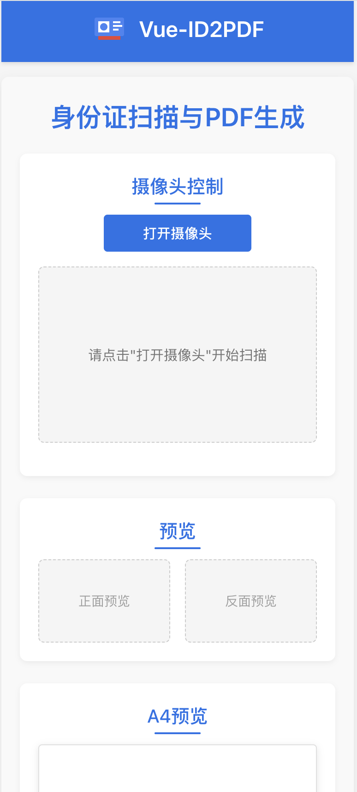

# Vue-ID2PDF

一个基于Vue 3的身份证扫描与PDF生成工具，提供了高效的身份证信息采集解决方案。

**[➡️ 在线体验地址](https://vue-id2pdf.pages.dev)**

## 功能特性

- 📷 支持实时摄像头采集身份证正反面图像
- 🤖 基于OpenCV.js的智能身份证边缘检测与自动捕获
- ✂️ 灵活的图像裁剪与调整功能
- 📄 一键生成标准A4格式PDF文档
- 📱 响应式设计，同时支持桌面端和移动端设备

## 运行截图



## 技术栈

- Vue 3 + Composition API
- Vite 构建工具
- OpenCV.js 用于图像处理和检测
- jsPDF 用于PDF生成
- Cropper.js 用于图像裁剪

## 快速开始

### 安装依赖

```bash
# 使用npm
npm install

# 或使用yarn
yarn

# 或使用pnpm
pnpm install
```

### 开发模式

```bash
npm run dev
```

### 生产构建

```bash
npm run build
```

### 预览构建结果

```bash
npm run preview
```

## 使用指南

1. 点击"打开摄像头"按钮启动相机
2. 将身份证放置在摄像头前，可选择"开启自动检测"让系统自动识别并捕获，或手动点击"拍摄正面"/"拍摄反面"
3. 捕获完成后，如有需要，可点击"编辑正面"/"编辑反面"按钮进行裁剪调整
4. 当正反面都准备就绪后，A4预览区域会显示排版效果
5. 点击"生成并下载PDF"按钮即可获取包含身份证正反面的PDF文件

## 注意事项

- 使用Chrome或Edge等现代浏览器获得最佳体验
- 在移动设备上使用时，请确保授予相机权限
- 为保护隐私，所有图像处理均在本地进行，不会上传到任何服务器

## 许可

[MIT 许可证](LICENSE)
